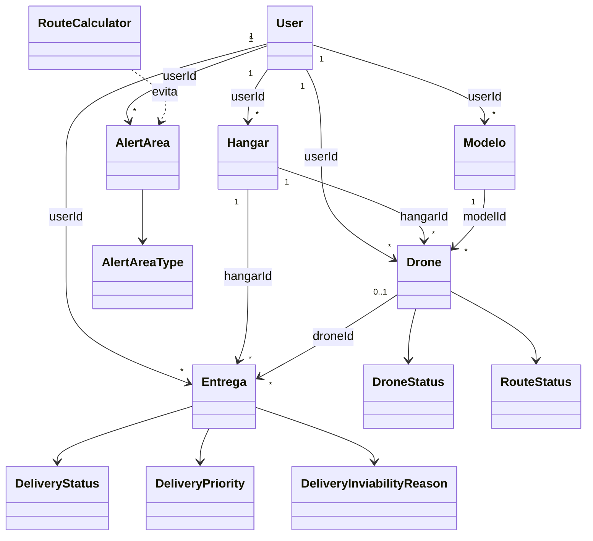

# Arquitetura e relações entre classes

Documentação derivada do código-fonte atual do sistema Fretes Drones.

## Visão arquitetural

```text
Frontend React → API/Controllers → Services → Repositories → MongoDB
                         ↑
                Segurança JWT
```

## Relações do domínio

| Origem | Destino | Cardinalidade | Implementação | Significado |
| --- | --- | --- | --- | --- |
| User | Hangar | 1 : N | Hangar.userId | Um usuário possui vários hangares. |
| User | Modelo | 1 : N | Modelo.userId | Um usuário mantém seus próprios modelos de drone. |
| User | Drone | 1 : N | Drone.userId | Um usuário possui vários drones. |
| User | Entrega | 1 : N | Entrega.userId | Um usuário cadastra várias entregas. |
| User | AlertArea | 1 : N | AlertArea.userId | Um usuário mantém suas áreas de alerta. |
| Hangar | Drone | 1 : N | Drone.hangarId | Cada drone opera a partir de um hangar. |
| Hangar | Entrega | 1 : N | Entrega.hangarId | Cada entrega é preparada em um hangar. |
| Modelo | Drone | 1 : N | Drone.modelId | O modelo fornece parâmetros de autonomia, peso e velocidade. |
| Drone | Entrega | 0..1 : N | Entrega.droneId e Drone.routeDeliveryIds | A alocação vincula entregas ao drone e à rota ativa. |
| Entrega | DeliveryPriority | N : 1 | Entrega.priority | A prioridade ordena o processamento da fila. |
| Entrega | DeliveryStatus | N : 1 | Entrega.status | O status representa o ciclo de vida da entrega. |
| Entrega | DeliveryInviabilityReason | N : 0..1 | Entrega.inviabilityReason | Registra motivo específico quando a entrega é inviável. |
| Drone | DroneStatus | N : 1 | Drone.status | Representa disponibilidade, despacho, rota, manutenção ou recarga. |
| Drone | RouteStatus | N : 0..1 | Drone.routeStatus | Controla preparação e execução da rota. |
| AlertArea | AlertAreaType | N : 1 | AlertArea.type | Classifica a região como inviável, construção ou insegura. |
| RouteCalculator | AlertArea | N : N | parâmetro restrictedAreas | O cálculo evita áreas restritas com margem mínima de uma coordenada. |

## Diagrama lógico do domínio



## Dependências do backend

| Origem | Destino | Relação |
| --- | --- | --- |
| AlertAreaController | AlertAreaService | dependência injetada |
| AlertAreaController | AuthenticatedUserService | dependência injetada |
| AlertAreaRepository | MongoRepository | herança |
| AlertAreaService | AlertAreaRepository | dependência injetada |
| AlertAreaService | HangarRepository | dependência injetada |
| AuthController | AuthService | dependência injetada |
| AuthenticatedUserService | UserRepository | dependência injetada |
| AuthService | JwtUtil | dependência injetada |
| AuthService | UserRepository | dependência injetada |
| CustomUserDetailsService | UserDetailsService | implementação |
| DeliveryAllocationService | DroneRepository | dependência injetada |
| DeliveryAllocationService | EntregaRepository | dependência injetada |
| DeliveryAllocationService | RoutePlanningService | dependência injetada |
| DeliveryCompletionService | EntregaRepository | dependência injetada |
| DeliveryDispatchConfirmationService | DeliveryAllocationService | dependência injetada |
| DeliveryDispatchConfirmationService | DeliveryManagementQueryService | dependência injetada |
| DeliveryDispatchConfirmationService | DeliveryViabilityService | dependência injetada |
| DeliveryDispatchConfirmationService | EntregaRepository | dependência injetada |
| DeliveryDispatchConfirmationService | HangarAccessService | dependência injetada |
| DeliveryDispatchPreparationService | DeliveryManagementQueryService | dependência injetada |
| DeliveryDispatchPreparationService | DroneRepository | dependência injetada |
| DeliveryDispatchPreparationService | EntregaRepository | dependência injetada |
| DeliveryDispatchPreparationService | HangarAccessService | dependência injetada |
| DeliveryManagementQueryService | DeliveryMapper | dependência injetada |
| DeliveryManagementQueryService | DroneMapper | dependência injetada |
| DeliveryManagementQueryService | DroneRepository | dependência injetada |
| DeliveryManagementQueryService | EntregaRepository | dependência injetada |
| DeliveryManagementQueryService | HangarAccessService | dependência injetada |
| DeliveryManagementService | DeliveryDispatchConfirmationService | dependência injetada |
| DeliveryManagementService | DeliveryDispatchPreparationService | dependência injetada |
| DeliveryManagementService | DeliveryManagementQueryService | dependência injetada |
| DeliveryManagementService | DeliveryQueueService | dependência injetada |
| DeliveryOperationsScheduler | DeliveryCompletionService | dependência injetada |
| DeliveryOperationsScheduler | DroneChargingService | dependência injetada |
| DeliveryOperationsScheduler | DroneFlightBatteryService | dependência injetada |
| DeliveryOperationsScheduler | RouteCompletionService | dependência injetada |
| DeliveryQueueService | DeliveryManagementQueryService | dependência injetada |
| DeliveryQueueService | EntregaRepository | dependência injetada |
| DeliveryQueueService | HangarAccessService | dependência injetada |
| DeliveryService | DeliveryMapper | dependência injetada |
| DeliveryService | EntregaRepository | dependência injetada |
| DeliveryService | HangarAccessService | dependência injetada |
| DeliverySplitService | DeliveryMapper | dependência injetada |
| DeliverySplitService | DeliveryService | dependência injetada |
| DeliverySplitService | DroneRepository | dependência injetada |
| DeliverySplitService | EntregaRepository | dependência injetada |
| DeliverySplitService | HangarRepository | dependência injetada |
| DeliveryViabilityService | AlertAreaRepository | dependência injetada |
| DeliveryViabilityService | RouteCalculator | dependência injetada |
| DroneChargingService | DeliveryAllocationService | dependência injetada |
| DroneChargingService | DroneRepository | dependência injetada |
| DroneController | AuthenticatedUserService | dependência injetada |
| DroneController | DroneOperationService | dependência injetada |
| DroneController | DroneService | dependência injetada |
| DroneFlightBatteryService | DroneRepository | dependência injetada |
| DroneOperationService | DeliveryAllocationService | dependência injetada |
| DroneOperationService | DroneMapper | dependência injetada |
| DroneOperationService | DroneRepository | dependência injetada |
| DroneOperationService | EntregaRepository | dependência injetada |
| DroneOperationService | HangarRepository | dependência injetada |
| DroneOperationService | RoutePlanningService | dependência injetada |
| DroneRepository | MongoRepository | herança |
| DroneService | DeliveryAllocationService | dependência injetada |
| DroneService | DroneMapper | dependência injetada |
| DroneService | DroneRepository | dependência injetada |
| DroneService | HangarRepository | dependência injetada |
| DroneService | ModeloRepository | dependência injetada |
| EntregaController | AuthenticatedUserService | dependência injetada |
| EntregaController | DeliveryManagementService | dependência injetada |
| EntregaController | DeliveryService | dependência injetada |
| EntregaController | DeliverySplitService | dependência injetada |
| EntregaRepository | MongoRepository | herança |
| HangarAccessService | HangarRepository | dependência injetada |
| HangarController | AuthenticatedUserService | dependência injetada |
| HangarController | HangarService | dependência injetada |
| HangarRepository | MongoRepository | herança |
| HangarService | HangarMapper | dependência injetada |
| HangarService | HangarRepository | dependência injetada |
| HealthController | UserRepository | dependência injetada |
| InvalidCredentialsException | RuntimeException | herança |
| JwtAuthenticationFilter | OncePerRequestFilter | herança |
| ModeloController | AuthenticatedUserService | dependência injetada |
| ModeloController | ModeloService | dependência injetada |
| ModeloRepository | MongoRepository | herança |
| ModeloService | ModeloMapper | dependência injetada |
| ModeloService | ModeloRepository | dependência injetada |
| RouteCompletionService | DroneRepository | dependência injetada |
| RouteCompletionService | RoutePlanningService | dependência injetada |
| RoutePlanningService | AlertAreaRepository | dependência injetada |
| RoutePlanningService | DroneRepository | dependência injetada |
| RoutePlanningService | HangarRepository | dependência injetada |
| RoutePlanningService | RouteCalculator | dependência injetada |
| UserRepository | MongoRepository | herança |

## Classes do backend

### fretesdrones

| Classe | Tipo | Responsabilidade | Arquivo |
| --- | --- | --- | --- |
| `FretesDronesApplication` | class | Inicializa o Spring Boot e habilita o agendamento das operações. | `backend/src/main/java/com/dtidigital/fretesdrones/FretesDronesApplication.java` |

### config

| Classe | Tipo | Responsabilidade | Arquivo |
| --- | --- | --- | --- |
| `RestExceptionHandler` | class | Configura segurança ou tratamento global de erros. | `backend/src/main/java/com/dtidigital/fretesdrones/config/RestExceptionHandler.java` |
| `SecurityConfig` | class | Configura segurança ou tratamento global de erros. | `backend/src/main/java/com/dtidigital/fretesdrones/config/SecurityConfig.java` |

### controller

| Classe | Tipo | Responsabilidade | Arquivo |
| --- | --- | --- | --- |
| `AlertAreaController` | class | Publica a API HTTP de alertarea e delega regras aos serviços. | `backend/src/main/java/com/dtidigital/fretesdrones/controller/AlertAreaController.java` |
| `AuthController` | class | Publica a API HTTP de auth e delega regras aos serviços. | `backend/src/main/java/com/dtidigital/fretesdrones/controller/AuthController.java` |
| `DroneController` | class | Publica a API HTTP de drone e delega regras aos serviços. | `backend/src/main/java/com/dtidigital/fretesdrones/controller/DroneController.java` |
| `EntregaController` | class | Publica a API HTTP de entrega e delega regras aos serviços. | `backend/src/main/java/com/dtidigital/fretesdrones/controller/EntregaController.java` |
| `HangarController` | class | Publica a API HTTP de hangar e delega regras aos serviços. | `backend/src/main/java/com/dtidigital/fretesdrones/controller/HangarController.java` |
| `HealthController` | class | Publica a API HTTP de health e delega regras aos serviços. | `backend/src/main/java/com/dtidigital/fretesdrones/controller/HealthController.java` |
| `ModeloController` | class | Publica a API HTTP de modelo e delega regras aos serviços. | `backend/src/main/java/com/dtidigital/fretesdrones/controller/ModeloController.java` |

### dto

| Classe | Tipo | Responsabilidade | Arquivo |
| --- | --- | --- | --- |
| `AlertAreaRequest` | record | Define o contrato de entrada ou saída da API. | `backend/src/main/java/com/dtidigital/fretesdrones/dto/AlertAreaRequest.java` |
| `AlertAreaResponse` | record | Define o contrato de entrada ou saída da API. | `backend/src/main/java/com/dtidigital/fretesdrones/dto/AlertAreaResponse.java` |
| `AuthRequest` | class | Define o contrato de entrada ou saída da API. | `backend/src/main/java/com/dtidigital/fretesdrones/dto/AuthRequest.java` |
| `AuthResponse` | class | Define o contrato de entrada ou saída da API. | `backend/src/main/java/com/dtidigital/fretesdrones/dto/AuthResponse.java` |
| `BulkUnassignRequest` | record | Define o contrato de entrada ou saída da API. | `backend/src/main/java/com/dtidigital/fretesdrones/dto/BulkUnassignRequest.java` |
| `ConfirmDispatchRequest` | record | Define o contrato de entrada ou saída da API. | `backend/src/main/java/com/dtidigital/fretesdrones/dto/ConfirmDispatchRequest.java` |
| `DeliveryManagementResponse` | record | Define o contrato de entrada ou saída da API. | `backend/src/main/java/com/dtidigital/fretesdrones/dto/DeliveryManagementResponse.java` |
| `DroneOptionsResponse` | record | Define o contrato de entrada ou saída da API. | `backend/src/main/java/com/dtidigital/fretesdrones/dto/DroneOptionsResponse.java` |
| `DroneRequest` | class | Define o contrato de entrada ou saída da API. | `backend/src/main/java/com/dtidigital/fretesdrones/dto/DroneRequest.java` |
| `DroneResponse` | class | Define o contrato de entrada ou saída da API. | `backend/src/main/java/com/dtidigital/fretesdrones/dto/DroneResponse.java` |
| `DroneStatusRequest` | record | Define o contrato de entrada ou saída da API. | `backend/src/main/java/com/dtidigital/fretesdrones/dto/DroneStatusRequest.java` |
| `EntregaRequest` | class | Define o contrato de entrada ou saída da API. | `backend/src/main/java/com/dtidigital/fretesdrones/dto/EntregaRequest.java` |
| `EntregaResponse` | class | Define o contrato de entrada ou saída da API. | `backend/src/main/java/com/dtidigital/fretesdrones/dto/EntregaResponse.java` |
| `HangarRequest` | class | Define o contrato de entrada ou saída da API. | `backend/src/main/java/com/dtidigital/fretesdrones/dto/HangarRequest.java` |
| `HangarResponse` | class | Define o contrato de entrada ou saída da API. | `backend/src/main/java/com/dtidigital/fretesdrones/dto/HangarResponse.java` |
| `ModeloRequest` | class | Define o contrato de entrada ou saída da API. | `backend/src/main/java/com/dtidigital/fretesdrones/dto/ModeloRequest.java` |
| `ModeloResponse` | class | Define o contrato de entrada ou saída da API. | `backend/src/main/java/com/dtidigital/fretesdrones/dto/ModeloResponse.java` |
| `RegisterRequest` | class | Define o contrato de entrada ou saída da API. | `backend/src/main/java/com/dtidigital/fretesdrones/dto/RegisterRequest.java` |
| `SplitDeliveryRequest` | record | Define o contrato de entrada ou saída da API. | `backend/src/main/java/com/dtidigital/fretesdrones/dto/SplitDeliveryRequest.java` |

### exception

| Classe | Tipo | Responsabilidade | Arquivo |
| --- | --- | --- | --- |
| `InvalidCredentialsException` | class | Representa uma exceção específica de autenticação. | `backend/src/main/java/com/dtidigital/fretesdrones/exception/InvalidCredentialsException.java` |

### mapper

| Classe | Tipo | Responsabilidade | Arquivo |
| --- | --- | --- | --- |
| `DeliveryMapper` | class | Converte entidade de domínio em DTO de resposta. | `backend/src/main/java/com/dtidigital/fretesdrones/mapper/DeliveryMapper.java` |
| `DroneMapper` | class | Converte entidade de domínio em DTO de resposta. | `backend/src/main/java/com/dtidigital/fretesdrones/mapper/DroneMapper.java` |
| `HangarMapper` | class | Converte entidade de domínio em DTO de resposta. | `backend/src/main/java/com/dtidigital/fretesdrones/mapper/HangarMapper.java` |
| `ModeloMapper` | class | Converte entidade de domínio em DTO de resposta. | `backend/src/main/java/com/dtidigital/fretesdrones/mapper/ModeloMapper.java` |

### model

| Classe | Tipo | Responsabilidade | Arquivo |
| --- | --- | --- | --- |
| `AlertArea` | class | Representa uma entidade persistente do domínio. | `backend/src/main/java/com/dtidigital/fretesdrones/model/AlertArea.java` |
| `AlertAreaType` | enum | Define valores válidos de estado ou classificação do domínio. | `backend/src/main/java/com/dtidigital/fretesdrones/model/AlertAreaType.java` |
| `DeliveryInviabilityReason` | enum | Define valores válidos de estado ou classificação do domínio. | `backend/src/main/java/com/dtidigital/fretesdrones/model/DeliveryInviabilityReason.java` |
| `DeliveryPriority` | enum | Define valores válidos de estado ou classificação do domínio. | `backend/src/main/java/com/dtidigital/fretesdrones/model/DeliveryPriority.java` |
| `DeliveryStatus` | enum | Define valores válidos de estado ou classificação do domínio. | `backend/src/main/java/com/dtidigital/fretesdrones/model/DeliveryStatus.java` |
| `Drone` | class | Representa uma entidade persistente do domínio. | `backend/src/main/java/com/dtidigital/fretesdrones/model/Drone.java` |
| `DroneStatus` | enum | Define valores válidos de estado ou classificação do domínio. | `backend/src/main/java/com/dtidigital/fretesdrones/model/DroneStatus.java` |
| `Entrega` | class | Representa uma entidade persistente do domínio. | `backend/src/main/java/com/dtidigital/fretesdrones/model/Entrega.java` |
| `Hangar` | class | Representa uma entidade persistente do domínio. | `backend/src/main/java/com/dtidigital/fretesdrones/model/Hangar.java` |
| `Modelo` | class | Representa uma entidade persistente do domínio. | `backend/src/main/java/com/dtidigital/fretesdrones/model/Modelo.java` |
| `Role` | enum | Define valores válidos de estado ou classificação do domínio. | `backend/src/main/java/com/dtidigital/fretesdrones/model/Role.java` |
| `RouteStatus` | enum | Define valores válidos de estado ou classificação do domínio. | `backend/src/main/java/com/dtidigital/fretesdrones/model/RouteStatus.java` |
| `User` | class | Representa uma entidade persistente do domínio. | `backend/src/main/java/com/dtidigital/fretesdrones/model/User.java` |

### repository

| Classe | Tipo | Responsabilidade | Arquivo |
| --- | --- | --- | --- |
| `AlertAreaRepository` | interface | Persiste e consulta AlertArea no MongoDB. | `backend/src/main/java/com/dtidigital/fretesdrones/repository/AlertAreaRepository.java` |
| `DroneRepository` | interface | Persiste e consulta Drone no MongoDB. | `backend/src/main/java/com/dtidigital/fretesdrones/repository/DroneRepository.java` |
| `EntregaRepository` | interface | Persiste e consulta Entrega no MongoDB. | `backend/src/main/java/com/dtidigital/fretesdrones/repository/EntregaRepository.java` |
| `HangarRepository` | interface | Persiste e consulta Hangar no MongoDB. | `backend/src/main/java/com/dtidigital/fretesdrones/repository/HangarRepository.java` |
| `ModeloRepository` | interface | Persiste e consulta Modelo no MongoDB. | `backend/src/main/java/com/dtidigital/fretesdrones/repository/ModeloRepository.java` |
| `UserRepository` | interface | Persiste e consulta User no MongoDB. | `backend/src/main/java/com/dtidigital/fretesdrones/repository/UserRepository.java` |

### routing

| Classe | Tipo | Responsabilidade | Arquivo |
| --- | --- | --- | --- |
| `RouteCalculator` | class | Calcula a menor rota válida e os desvios de zonas restritas. | `backend/src/main/java/com/dtidigital/fretesdrones/routing/RouteCalculator.java` |
| `RoutePlan` | record | Agrupa a ordem das entregas e a distância calculada. | `backend/src/main/java/com/dtidigital/fretesdrones/routing/RoutePlan.java` |

### security

| Classe | Tipo | Responsabilidade | Arquivo |
| --- | --- | --- | --- |
| `AuthenticatedUserService` | class | Implementa autenticação, autorização e resolução do usuário autenticado. | `backend/src/main/java/com/dtidigital/fretesdrones/security/AuthenticatedUserService.java` |
| `CustomUserDetailsService` | class | Implementa autenticação, autorização e resolução do usuário autenticado. | `backend/src/main/java/com/dtidigital/fretesdrones/security/CustomUserDetailsService.java` |
| `JwtAuthenticationFilter` | class | Implementa autenticação, autorização e resolução do usuário autenticado. | `backend/src/main/java/com/dtidigital/fretesdrones/security/JwtAuthenticationFilter.java` |
| `JwtUtil` | class | Implementa autenticação, autorização e resolução do usuário autenticado. | `backend/src/main/java/com/dtidigital/fretesdrones/security/JwtUtil.java` |

### service

| Classe | Tipo | Responsabilidade | Arquivo |
| --- | --- | --- | --- |
| `AlertAreaService` | class | Orquestra regras e operações de alert area. | `backend/src/main/java/com/dtidigital/fretesdrones/service/AlertAreaService.java` |
| `AuthService` | class | Orquestra regras e operações de auth. | `backend/src/main/java/com/dtidigital/fretesdrones/service/AuthService.java` |
| `DeliveryAllocationService` | class | Orquestra regras e operações de delivery allocation. | `backend/src/main/java/com/dtidigital/fretesdrones/service/DeliveryAllocationService.java` |
| `DeliveryCompletionService` | class | Orquestra regras e operações de delivery completion. | `backend/src/main/java/com/dtidigital/fretesdrones/service/DeliveryCompletionService.java` |
| `DeliveryDispatchConfirmationService` | class | Orquestra regras e operações de delivery dispatch confirmation. | `backend/src/main/java/com/dtidigital/fretesdrones/service/DeliveryDispatchConfirmationService.java` |
| `DeliveryDispatchPreparationService` | class | Orquestra regras e operações de delivery dispatch preparation. | `backend/src/main/java/com/dtidigital/fretesdrones/service/DeliveryDispatchPreparationService.java` |
| `DeliveryManagementQueryService` | class | Orquestra regras e operações de delivery management query. | `backend/src/main/java/com/dtidigital/fretesdrones/service/DeliveryManagementQueryService.java` |
| `DeliveryManagementService` | class | Orquestra regras e operações de delivery management. | `backend/src/main/java/com/dtidigital/fretesdrones/service/DeliveryManagementService.java` |
| `DeliveryOperationsScheduler` | class | Orquestra regras e operações de delivery operations scheduler. | `backend/src/main/java/com/dtidigital/fretesdrones/service/DeliveryOperationsScheduler.java` |
| `DeliveryQueueService` | class | Orquestra regras e operações de delivery queue. | `backend/src/main/java/com/dtidigital/fretesdrones/service/DeliveryQueueService.java` |
| `DeliveryService` | class | Orquestra regras e operações de delivery. | `backend/src/main/java/com/dtidigital/fretesdrones/service/DeliveryService.java` |
| `DeliverySplitService` | class | Orquestra regras e operações de delivery split. | `backend/src/main/java/com/dtidigital/fretesdrones/service/DeliverySplitService.java` |
| `DeliveryViabilityService` | class | Orquestra regras e operações de delivery viability. | `backend/src/main/java/com/dtidigital/fretesdrones/service/DeliveryViabilityService.java` |
| `DroneChargingService` | class | Orquestra regras e operações de drone charging. | `backend/src/main/java/com/dtidigital/fretesdrones/service/DroneChargingService.java` |
| `DroneFlightBatteryService` | class | Orquestra regras e operações de drone flight battery. | `backend/src/main/java/com/dtidigital/fretesdrones/service/DroneFlightBatteryService.java` |
| `DroneOperationService` | class | Orquestra regras e operações de drone operation. | `backend/src/main/java/com/dtidigital/fretesdrones/service/DroneOperationService.java` |
| `DroneService` | class | Orquestra regras e operações de drone. | `backend/src/main/java/com/dtidigital/fretesdrones/service/DroneService.java` |
| `HangarAccessService` | class | Orquestra regras e operações de hangar access. | `backend/src/main/java/com/dtidigital/fretesdrones/service/HangarAccessService.java` |
| `HangarService` | class | Orquestra regras e operações de hangar. | `backend/src/main/java/com/dtidigital/fretesdrones/service/HangarService.java` |
| `ModeloService` | class | Orquestra regras e operações de modelo. | `backend/src/main/java/com/dtidigital/fretesdrones/service/ModeloService.java` |
| `RouteCompletionService` | class | Orquestra regras e operações de route completion. | `backend/src/main/java/com/dtidigital/fretesdrones/service/RouteCompletionService.java` |
| `RoutePlanningService` | class | Orquestra regras e operações de route planning. | `backend/src/main/java/com/dtidigital/fretesdrones/service/RoutePlanningService.java` |

## Relações internas do frontend

| Origem | Destino | Relação |
| --- | --- | --- |
| Alertas | alertService | importa/compõe |
| Alertas | errorMessage | importa/compõe |
| Alertas | hangarService | importa/compõe |
| alertService | api | importa/compõe |
| App | Alertas | importa/compõe |
| App | AppLayout | importa/compõe |
| App | AuthContext | importa/compõe |
| App | Cidade | importa/compõe |
| App | Dashboard | importa/compõe |
| App | DashboardDrones | importa/compõe |
| App | Drones | importa/compõe |
| App | Entregas | importa/compõe |
| App | GerenciarDrones | importa/compõe |
| App | GerenciarEntregas | importa/compõe |
| App | GerenciarHangars | importa/compõe |
| App | HangarContext | importa/compõe |
| App | Hangars | importa/compõe |
| App | Login | importa/compõe |
| App | Modelos | importa/compõe |
| App | PedidosPorEstado | importa/compõe |
| App | Register | importa/compõe |
| AppLayout | AuthContext | importa/compõe |
| AppLayout | HangarContext | importa/compõe |
| AppLayout | hangarService | importa/compõe |
| authService | api | importa/compõe |
| Cidade | alertService | importa/compõe |
| Cidade | errorMessage | importa/compõe |
| Cidade | hangarService | importa/compõe |
| Dashboard | errorMessage | importa/compõe |
| Dashboard | HangarContext | importa/compõe |
| Dashboard | HangarRouteMap | importa/compõe |
| DashboardDrones | errorMessage | importa/compõe |
| DashboardDrones | HangarContext | importa/compõe |
| dashboardService | deliveryService | importa/compõe |
| dashboardService | droneService | importa/compõe |
| dashboardService | hangarService | importa/compõe |
| dashboardService | modelService | importa/compõe |
| deliveryService | api | importa/compõe |
| deliveryService | hangarService | importa/compõe |
| Drones | errorMessage | importa/compõe |
| droneService | api | importa/compõe |
| droneService | hangarService | importa/compõe |
| droneService | modelService | importa/compõe |
| Entregas | errorMessage | importa/compõe |
| GerenciarDrones | dashboardService | importa/compõe |
| GerenciarDrones | HangarContext | importa/compõe |
| GerenciarDrones | RemainingTime | importa/compõe |
| GerenciarEntregas | alertService | importa/compõe |
| GerenciarEntregas | HangarContext | importa/compõe |
| GerenciarEntregas | hangarService | importa/compõe |
| GerenciarHangars | dashboardService | importa/compõe |
| GerenciarHangars | HangarContext | importa/compõe |
| GerenciarHangars | HangarRouteMap | importa/compõe |
| GerenciarHangars | RemainingTime | importa/compõe |
| HangarRouteMap | alertService | importa/compõe |
| HangarRouteMap | drone.png | importa/compõe |
| Hangars | errorMessage | importa/compõe |
| hangarService | api | importa/compõe |
| Login | AuthContext | importa/compõe |
| Modelos | errorMessage | importa/compõe |
| modelService | api | importa/compõe |
| PedidosPorEstado | errorMessage | importa/compõe |
| Register | AuthContext | importa/compõe |

## Módulos do frontend

### app

| Módulo | Tipo | Responsabilidade | Arquivo |
| --- | --- | --- | --- |
| `App` | componente React | Composição de rotas, providers e proteção de acesso do frontend. | `frontend/src/App.jsx` |

### components

| Módulo | Tipo | Responsabilidade | Arquivo |
| --- | --- | --- | --- |
| `AppLayout` | componente React | Componente visual reutilizável. | `frontend/src/components/layout/AppLayout.jsx` |
| `HangarRouteMap` | componente React | Componente visual reutilizável. | `frontend/src/components/maps/HangarRouteMap.jsx` |
| `RemainingTime` | componente React | Componente visual reutilizável. | `frontend/src/components/feedback/RemainingTime.jsx` |

### context

| Módulo | Tipo | Responsabilidade | Arquivo |
| --- | --- | --- | --- |
| `AuthContext` | componente React | Provider de estado compartilhado da aplicação React. | `frontend/src/context/AuthContext.jsx` |
| `HangarContext` | componente React | Provider de estado compartilhado da aplicação React. | `frontend/src/context/HangarContext.jsx` |

### pages/auth

| Módulo | Tipo | Responsabilidade | Arquivo |
| --- | --- | --- | --- |
| `Login` | componente React | Página navegável da interface e orquestração de suas interações. | `frontend/src/pages/auth/Login.jsx` |
| `Register` | componente React | Página navegável da interface e orquestração de suas interações. | `frontend/src/pages/auth/Register.jsx` |

### pages/cidade

| Módulo | Tipo | Responsabilidade | Arquivo |
| --- | --- | --- | --- |
| `Alertas` | componente React | Página navegável da interface e orquestração de suas interações. | `frontend/src/pages/cidade/Alertas.jsx` |
| `Cidade` | componente React | Página navegável da interface e orquestração de suas interações. | `frontend/src/pages/cidade/Cidade.jsx` |

### pages/dashboard

| Módulo | Tipo | Responsabilidade | Arquivo |
| --- | --- | --- | --- |
| `Dashboard` | componente React | Página navegável da interface e orquestração de suas interações. | `frontend/src/pages/dashboard/Dashboard.jsx` |
| `DashboardDrones` | componente React | Página navegável da interface e orquestração de suas interações. | `frontend/src/pages/dashboard/DashboardDrones.jsx` |
| `PedidosPorEstado` | componente React | Página navegável da interface e orquestração de suas interações. | `frontend/src/pages/dashboard/PedidosPorEstado.jsx` |

### pages/drones

| Módulo | Tipo | Responsabilidade | Arquivo |
| --- | --- | --- | --- |
| `Drones` | componente React | Página navegável da interface e orquestração de suas interações. | `frontend/src/pages/drones/Drones.jsx` |
| `GerenciarDrones` | componente React | Página navegável da interface e orquestração de suas interações. | `frontend/src/pages/drones/GerenciarDrones.jsx` |

### pages/entregas

| Módulo | Tipo | Responsabilidade | Arquivo |
| --- | --- | --- | --- |
| `Entregas` | componente React | Página navegável da interface e orquestração de suas interações. | `frontend/src/pages/entregas/Entregas.jsx` |
| `GerenciarEntregas` | componente React | Página navegável da interface e orquestração de suas interações. | `frontend/src/pages/entregas/GerenciarEntregas.jsx` |

### pages/hangars

| Módulo | Tipo | Responsabilidade | Arquivo |
| --- | --- | --- | --- |
| `GerenciarHangars` | componente React | Página navegável da interface e orquestração de suas interações. | `frontend/src/pages/hangars/GerenciarHangars.jsx` |
| `Hangars` | componente React | Página navegável da interface e orquestração de suas interações. | `frontend/src/pages/hangars/Hangars.jsx` |

### pages/modelos

| Módulo | Tipo | Responsabilidade | Arquivo |
| --- | --- | --- | --- |
| `Modelos` | componente React | Página navegável da interface e orquestração de suas interações. | `frontend/src/pages/modelos/Modelos.jsx` |

### services

| Módulo | Tipo | Responsabilidade | Arquivo |
| --- | --- | --- | --- |
| `alertService` | módulo JavaScript | Integra a interface com a API e aplica transformações de dados. | `frontend/src/services/alertService.js` |
| `api` | módulo JavaScript | Integra a interface com a API e aplica transformações de dados. | `frontend/src/services/api.js` |
| `authService` | módulo JavaScript | Integra a interface com a API e aplica transformações de dados. | `frontend/src/services/authService.js` |
| `authValidation` | módulo JavaScript | Integra a interface com a API e aplica transformações de dados. | `frontend/src/services/authValidation.js` |
| `dashboardService` | módulo JavaScript | Integra a interface com a API e aplica transformações de dados. | `frontend/src/services/dashboardService.js` |
| `deliveryService` | módulo JavaScript | Integra a interface com a API e aplica transformações de dados. | `frontend/src/services/deliveryService.js` |
| `droneService` | módulo JavaScript | Integra a interface com a API e aplica transformações de dados. | `frontend/src/services/droneService.js` |
| `hangarService` | módulo JavaScript | Integra a interface com a API e aplica transformações de dados. | `frontend/src/services/hangarService.js` |
| `modelService` | módulo JavaScript | Integra a interface com a API e aplica transformações de dados. | `frontend/src/services/modelService.js` |

### utils

| Módulo | Tipo | Responsabilidade | Arquivo |
| --- | --- | --- | --- |
| `errorMessage` | módulo JavaScript | Função utilitária reutilizável. | `frontend/src/utils/errorMessage.js` |
